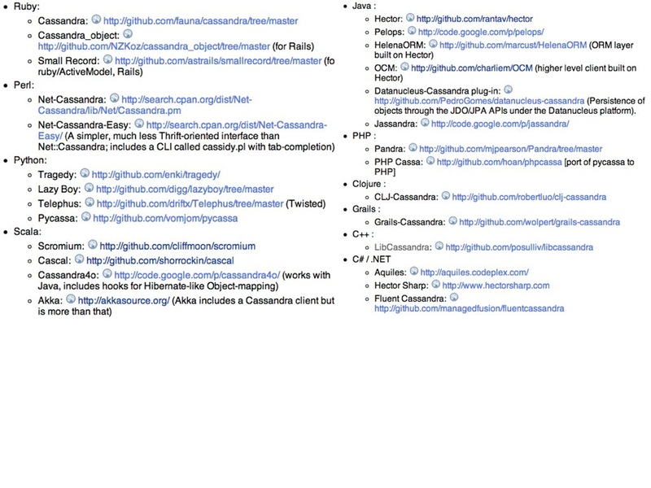

!SLIDE
# Cliff Moon #
## http://github.com/cliffmoon ##
## http://twitter.com/moonpolysoft ##
## cliff@leaninto.it ##

!SLIDE
# Cassandra's API #

!SLIDE bullets incremental
# Thrift #

* Pidgin language for object oriented serialization.
* Serious protocol level problems.

!SLIDE center

## Same Shit ##
## Different Format ##

!SLIDE bullets incremental
# Avro Integration #

* Possibly will not happen.
* Reimplementation of Thrift API.
* Does not address the real problem.

!SLIDE center

## Cassandra Clients ##

!SLIDE
# Why does Cassandra have so many clients? #

!SLIDE
# Comparative Design Review #
